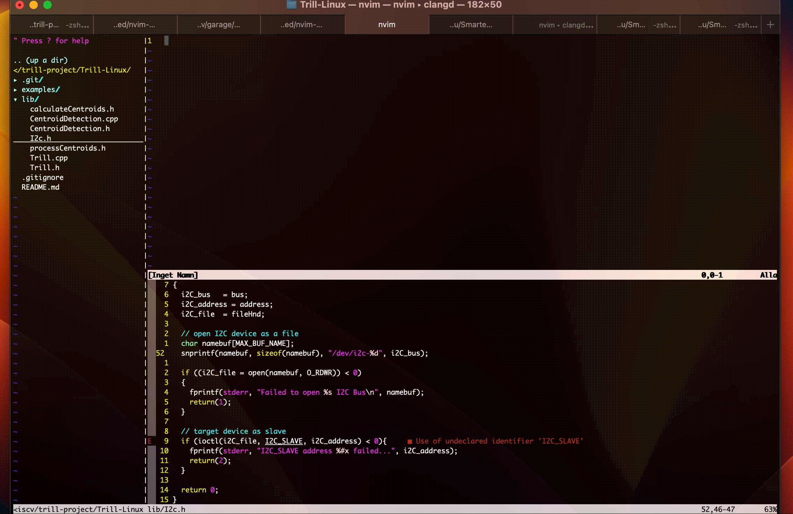

# FORK

This is a fork from the original repo.
It seemed to have stopped development.
So it is maintained here now.

Things this fork has added:

- Chat
- Support for chat based models (gpt-3.5-turbo, gpt-4)
- Document Q&A (using indexer for handling out-of-context sized content)
- Codebase generation

## Environment variables

This uses the value of $OPENAI_API_KEY from the current enviroment. It should be set to your OpenAI API key.

## Default model

The default model used is gpt-3.5-turbo.
Edit this file if you want to use something else:

[lua/nvim-magic-openai/init.lua](https://github.com/Ricardicus/nvim-magic/blob/master/lua/nvim-magic-openai/init.lua)

## Features

- Completion
- Docstring
- Alteration
- Chat
- Document Q&A
- Codebase generations

When using chat, the window you focus on when you start the chat will be
selected for the rest of the session. Until Neovim is closed or until you
manually reset the chat (<Leader>mcc). If text is selected in the visual,
this information is passed along with the query but hidden from the chat window.
See the demo gif below.

### Chat (`<Leader>mcc`)



### Generate codebase (`<Leader>mcb`)

You'll want to double check the code, but this should be enough to get you started on your project.


### Document Q&A (`<Leader>mcq`)

Ask questions about documents of any size. You need to set up a chat window beforehand.
The cursor needs to be in the document that you want to ask questions about.


### Completion (`<Leader>mcs`)


### Generating a docstring (`<Leader>mds`)


### Asking for an alteration (`<Leader>mss`)


## Quickstart

### Prerequisites

- latest stable version of Neovim (nightly may work as well)
- `curl`
- OpenAI API key

### Installation

```lua
-- using packer.nvim
use({
	'ricardicus/nvim-magic',
	config = function()
		require('nvim-magic').setup()
	end,
	requires = {
		'nvim-lua/plenary.nvim',
		'MunifTanjim/nui.nvim'
	}
})
```

See [docs/config.md](docs/config.md) if you want to override the default configuration e.g. to turn off the default keymaps, or use a different OpenAI model (defaults to `gpt-3.5-turbo`).

Your API key should be made available to your Neovim session in an environment variable `OPENAI_API_KEY`. See [docs/openai.md](docs/openai.md) for more details. Note that API calls may be charged for by OpenAI depending on the model used.

```shell
 export OPENAI_API_KEY='your-api-key-here'
```

### Keymaps

These flows have keymaps set by default for visual mode selections (though you can disable this by passing `use_default_keymap = false` in the setup config).

You can map your own key sequences to the predefined `<Plug>`s if you don't want to use the default keymaps.

| `<Plug>`                               | default keymap | mode   | action                                       |
| -------------------------------------- | -------------- | ------ | -------------------------------------------- |
| `<Plug>nvim-magic-append-completion`   | `<Leader>mcs`  | visual | Fetch and append completion                  |
| `<Plug>nvim-magic-suggest-alteration`  | `<Leader>mss`  | visual | Ask for an alteration to the selected text   |
| `<Plug>nvim-magic-suggest-docstring`   | `<Leader>mds`  | visual | Generate a docstring                         |
| `<Plug>nvim-magic-suggest-chat`        | `<Leader>mcc`  | visual | Chat, ask questions, keep the context        |
| `<Plug>nvim-magic-suggest-chat-reset`  | `<Leader>mcr`  | visual | Chat, reset history, start over              |
| `<Plug>nvim-magic-doc-qa-chat`         | `<Leader>mcq`  | visual | Ask questions about a document (requires active chat window and cursor placed in the document of interest) |
| `<Plug>nvim-magic-gen-codebase`        | `<Leader>mcb`  | visual | Generate initial codebase (quality may vary) |

## Development

There is a [development container](https://containers.dev/) specified under the [`.devcontainer`](.devcontainer/) directory, that builds and installs the latest stable version of Neovim, and sets it up to use the local `nvim-magic` repo as a plugin.
